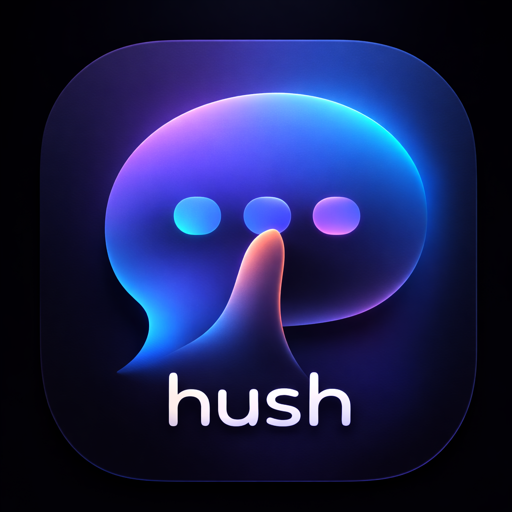

# Hush

<p align="center">
  
</p>

macOS 原生 LLM Chat 客户端.

## 为什么是 Hush

- **Swift 原生**
- **支持流式对话和多会话并发处理**
- **支持markdown和Latex格式渲染**
- **自定义provider**
- **本地优先,Sqlite存储数据在本地**

## 快速开发

命令：

```bash
make setup   # 安装 swiftformat / swiftlint / fswatch + resolve SPM
make build   # Debug build
make run     # 启动 .app 并 stream 日志
make test    # 跑单元测试（Swift Testing）
```

## Release（DMG）

```bash
make release
ls build/release
```

说明：
- 本项目默认不做 Developer ID 签名/公证：从互联网下载的 DMG 在部分 macOS 上会被 Gatekeeper 拦截。
  - 用户侧常用打开方式：在 `/Applications` 里右键 `Hush.app` → 打开
  - 或执行：`xattr -dr com.apple.quarantine /Applications/Hush.app`

## 目录结构

```text
Hush/            # App + feature modules
HushCore/        # Domain models / scheduler logic
HushProviders/   # Provider 协议与实现
HushRendering/   # Markdown/LaTeX 渲染与缓存
HushStorage/     # GRDB repositories / migrations / keychain bridge
Views/           # SwiftUI + AppKit bridge views
HushTests/       # Swift Testing suites
openspec/        # Spec-driven workflow artifacts
doc/             # Engineering docs（架构/流程/排障）
```
